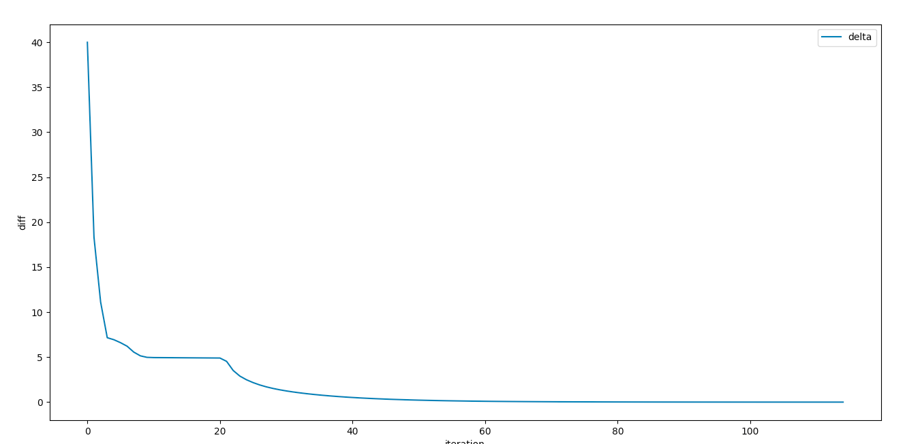

# Report

Team 8  - Dunder Mifflin - Abhijeeth Singam,  Saravanan Senthil

Interpretation of the trace:

- Since step-cost is -5, IJ is more tolerant to 'wasting' moves to avoid getting hit by moving to centre or east when the monster is in ready state. We see this especially in the West square when MM is ready to attack. In such a state, IJ's best action is simply to STAY until MM goes into the dormant state.
- We notice that IJ often tries to move towards east. This is because east is prime attacking location where IJ's attacks have the highest probability of success. 
- Based on the trace, we can tell that a common pattern of moves is:
  - Move to East
  - Maybe choose to gather and craft arrows depending on if MM is ready to attack
  - Hit repeatedly

- Graph for the convergence:

	

	As shown in the graph, the maximum absolute difference between successive iterations  decreases.

Simulations:

1. Start: (W, 0, 0, D, 100)

	```
	state:  ('W', 0, 0, 'D', 100) ;action:  RIGHT
	state:  ('C', 0, 0, 'R', 100) ;action:  DOWN
	state:  ('S', 0, 0, 'R', 100) ;action:  GATHER
	state:  ('S', 0, 0, 'D', 100) ;action:  UP
	state:  ('C', 0, 0, 'D', 100) ;action:  RIGHT
	state:  ('E', 0, 0, 'D', 100) ;action:  HIT
	state:  ('E', 0, 0, 'R', 100) ;action:  HIT
	state:  ('E', 0, 0, 'D', 100) ;action:  HIT
	state:  ('E', 0, 0, 'D', 100) ;action:  HIT
	state:  ('E', 0, 0, 'R', 100) ;action:  HIT
	state:  ('E', 0, 0, 'R', 100) ;action:  HIT
	state:  ('E', 0, 0, 'R', 100) ;action:  HIT
	state:  ('E', 0, 0, 'R', 50) ;action:  HIT
	state:  ('E', 0, 0, 'D', 75) ;action:  HIT
	state:  ('E', 0, 0, 'D', 25) ;action:  HIT
	state:  ('E', 0, 0, 'D', 25) ;action:  HIT
	state:  ('E', 0, 0, 'D', 25) ;action:  HIT
	state:  ('E', 0, 0, 'D', 25) ;action:  HIT
	```

Comments:
- In step 3, we see IJ chooses to GATHER even though IJ never actually crafts and shoots. The reason for this is because GATHER acts similar to STAY but with a 100% success rate. This enables him to avoid moving to the east with a 15% chance. Avoiding this 15% chance is more important to IJ than gaining the one material.
- After that, we see IJ simply moving to east and constantly choosing to HIT. This is because the net step cost of gather enough materials, crafting them into arrows, moving to suitable position, shooting them, gathering more materials, and crafting those again and finally killing MM with the last few shots is more than the step cost of simply going to east and hitting MM repeatedly until MM dies. This is a common trend we see across many different starting states.
	

2. Start : (C, 2, 0, R, 100)

```
state:  ('C', 2, 0, 'R', 100) ;action:  UP
state:  ('N', 2, 0, 'R', 100) ;action:  CRAFT
state:  ('N', 1, 1, 'D', 100) ;action:  CRAFT
state:  ('N', 0, 3, 'R', 100) ;action:  STAY
state:  ('N', 0, 3, 'R', 100) ;action:  STAY
state:  ('N', 0, 3, 'D', 100) ;action:  DOWN
state:  ('C', 0, 3, 'D', 100) ;action:  RIGHT
state:  ('E', 0, 3, 'D', 100) ;action:  SHOOT
state:  ('E', 0, 2, 'D', 75) ;action:  SHOOT
state:  ('E', 0, 1, 'D', 50) ;action:  SHOOT
state:  ('E', 0, 0, 'D', 25) ;action:  HIT
state:  ('E', 0, 0, 'R', 25) ;action:  HIT
state:  ('E', 0, 0, 'R', 25) ;action:  HIT
state:  ('E', 0, 0, 'D', 50) ;action:  HIT
state:  ('E', 0, 0, 'D', 50) ;action:  HIT
state:  ('E', 0, 0, 'R', 50) ;action:  HIT
state:  ('E', 0, 0, 'R', 50) ;action:  HIT
state:  ('E', 0, 0, 'R', 50) ;action:  HIT
state:  ('E', 0, 0, 'R', 50) ;action:  HIT
state:  ('E', 0, 0, 'R', 50) ;action:  HIT
state:  ('E', 0, 0, 'R', 50) ;action:  HIT
state:  ('E', 0, 0, 'D', 75) ;action:  HIT
state:  ('E', 0, 0, 'D', 25) ;action:  HIT
state:  ('E', 0, 0, 'D', 25) ;action:  HIT
state:  ('E', 0, 0, 'R', 25) ;action:  HIT
state:  ('E', 0, 0, 'D', 50) ;action:  HIT

```

Comments:
- Here, in the first step we see that IJ moves UP instead of directly approaching MM and constantly performing HIT. This is because MM is in a ready state and IJ is likely to get hit. Thus, IJ moves up and avoids being hit. The reason he chooses UP instead of DOWN is due to the fact that he has 0 arrows and 2 materials. Thus by moving UP he can craft twice and gain arrows, and after 2 steps it is likely that MM has returned to the dormant state.
- We also notice that IJ continues to CRAFT even after MM enters the dormant state (the second CRAFT action). This is because IJ is already in the NORTH position and crafting would leave him with more arrows which is more useful in the long run (as we observe later). In the event that Indiana got three or maybe even 2 arrows from his first craft, he would have instead chosen to immediately move to the east square and start attacking MM with SHOOT and HIT.
- Once IJ reaches east, we see that IJ immediately shoots all three of his arrows. This is because of the chance that MM goes into the ready state and attacks IJ in which case IJ would lose all of his arrows. Thus, shooting all of them at the start is more beneficial. Also, by shooting his arrows, he reduces the number of successful HIT actions required to kill MM, and also makes the effect of getting attacked by MM less devastating (if MM has 50 health, getting HIT would mean killing MM wold require 2 successful HIT actions, while if MM has only 25 health, even after getting attacked, it would only take one successful HIT action to kill MM).
- After this, IJ continuously choose to HIT which is optimal as explained in the previous set of comments.

---

## Analysing the differences between cases
| state                 | policy1   | policy2   | policy3   | policy4   |
|:----------------------|:----------|:----------|:----------|:----------|
| ['C', 0, 0, 'D', 25]  | RIGHT     | RIGHT     | LEFT      | HIT       |
| ['C', 0, 0, 'D', 50]  | RIGHT     | RIGHT     | LEFT      | HIT       |
| ['C', 0, 0, 'D', 75]  | RIGHT     | RIGHT     | LEFT      | DOWN      |
| ['C', 0, 0, 'D', 100] | RIGHT     | RIGHT     | LEFT      | DOWN      |
| ['C', 0, 0, 'R', 25]  | DOWN      | DOWN      | LEFT      | HIT       |
| ['C', 0, 0, 'R', 50]  | DOWN      | DOWN      | LEFT      | HIT       |
| ['C', 0, 0, 'R', 75]  | DOWN      | DOWN      | LEFT      | DOWN      |
| ['C', 0, 0, 'R', 100] | DOWN      | DOWN      | LEFT      | DOWN      |
| ['C', 0, 1, 'D', 25]  | RIGHT     | RIGHT     | RIGHT     | SHOOT     |
| ['C', 0, 1, 'D', 50]  | RIGHT     | RIGHT     | LEFT      | HIT       |
| ['C', 0, 1, 'D', 75]  | RIGHT     | RIGHT     | LEFT      | LEFT      |
| ['C', 0, 1, 'D', 100] | RIGHT     | RIGHT     | LEFT      | DOWN      |
| ['C', 0, 1, 'R', 25]  | DOWN      | DOWN      | DOWN      | SHOOT     |
| ['C', 0, 1, 'R', 50]  | DOWN      | DOWN      | LEFT      | HIT       |
| ['C', 0, 1, 'R', 75]  | DOWN      | DOWN      | LEFT      | LEFT      |
| ['C', 0, 1, 'R', 100] | DOWN      | DOWN      | LEFT      | DOWN      |
| ['C', 0, 2, 'D', 25]  | RIGHT     | RIGHT     | RIGHT     | SHOOT     |
| ['C', 0, 2, 'D', 50]  | RIGHT     | RIGHT     | RIGHT     | HIT       |
| ['C', 0, 2, 'D', 75]  | RIGHT     | RIGHT     | LEFT      | LEFT      |
| ['C', 0, 2, 'D', 100] | RIGHT     | RIGHT     | LEFT      | LEFT      |
| ['C', 0, 2, 'R', 25]  | LEFT      | LEFT      | DOWN      | SHOOT     |
| ['C', 0, 2, 'R', 50]  | DOWN      | DOWN      | LEFT      | HIT       |
| ['C', 0, 2, 'R', 75]  | DOWN      | DOWN      | LEFT      | LEFT      |
| ['C', 0, 2, 'R', 100] | DOWN      | DOWN      | LEFT      | LEFT      |
| ['C', 0, 3, 'D', 25]  | RIGHT     | RIGHT     | SHOOT     | SHOOT     |
| ['C', 0, 3, 'D', 50]  | RIGHT     | RIGHT     | RIGHT     | HIT       |
| ['C', 0, 3, 'D', 75]  | RIGHT     | RIGHT     | LEFT      | LEFT      |
| ['C', 0, 3, 'D', 100] | RIGHT     | RIGHT     | LEFT      | LEFT      |
| ['C', 0, 3, 'R', 25]  | LEFT      | LEFT      | LEFT      | SHOOT     |
| ['C', 0, 3, 'R', 50]  | LEFT      | DOWN      | LEFT      | HIT       |
| ['C', 0, 3, 'R', 75]  | DOWN      | DOWN      | LEFT      | LEFT      |
| ['C', 0, 3, 'R', 100] | DOWN      | DOWN      | LEFT      | LEFT      |
| ['C', 1, 0, 'D', 25]  | UP        | UP        | UP        | HIT       |
| ['C', 1, 0, 'D', 50]  | RIGHT     | RIGHT     | LEFT      | HIT       |
| ['C', 1, 0, 'D', 75]  | UP        | UP        | LEFT      | DOWN      |
| ['C', 1, 0, 'D', 100] | RIGHT     | RIGHT     | LEFT      | DOWN      |
| ['C', 1, 0, 'R', 25]  | UP        | UP        | UP        | HIT       |
| ['C', 1, 0, 'R', 50]  | UP        | UP        | LEFT      | HIT       |
| ['C', 1, 0, 'R', 75]  | UP        | UP        | LEFT      | DOWN      |
| ['C', 1, 0, 'R', 100] | UP        | UP        | LEFT      | DOWN      |
| ['C', 1, 1, 'D', 25]  | RIGHT     | RIGHT     | RIGHT     | SHOOT     |
| ['C', 1, 1, 'D', 50]  | UP        | UP        | LEFT      | HIT       |
| ['C', 1, 1, 'D', 75]  | RIGHT     | RIGHT     | LEFT      | LEFT      |
| ['C', 1, 1, 'D', 100] | RIGHT     | RIGHT     | LEFT      | DOWN      |
| ['C', 1, 1, 'R', 25]  | SHOOT     | SHOOT     | UP        | SHOOT     |
| ['C', 1, 1, 'R', 50]  | UP        | UP        | LEFT      | HIT       |
| ['C', 1, 1, 'R', 75]  | UP        | UP        | LEFT      | LEFT      |
| ['C', 1, 1, 'R', 100] | UP        | UP        | LEFT      | DOWN      |
| ['C', 1, 2, 'D', 25]  | RIGHT     | RIGHT     | RIGHT     | SHOOT     |
| ['C', 1, 2, 'D', 50]  | RIGHT     | RIGHT     | RIGHT     | HIT       |
| ['C', 1, 2, 'D', 75]  | RIGHT     | RIGHT     | LEFT      | LEFT      |
| ['C', 1, 2, 'D', 100] | RIGHT     | RIGHT     | LEFT      | LEFT      |
| ['C', 1, 2, 'R', 25]  | LEFT      | LEFT      | DOWN      | SHOOT     |
| ['C', 1, 2, 'R', 50]  | UP        | DOWN      | LEFT      | HIT       |
| ['C', 1, 2, 'R', 75]  | UP        | UP        | LEFT      | LEFT      |
| ['C', 1, 2, 'R', 100] | UP        | DOWN      | LEFT      | LEFT      |
| ['C', 1, 3, 'D', 25]  | RIGHT     | RIGHT     | SHOOT     | SHOOT     |
| ['C', 1, 3, 'D', 50]  | RIGHT     | RIGHT     | RIGHT     | HIT       |
| ['C', 1, 3, 'D', 75]  | RIGHT     | RIGHT     | LEFT      | LEFT      |
| ['C', 1, 3, 'D', 100] | RIGHT     | RIGHT     | LEFT      | LEFT      |
| ['C', 1, 3, 'R', 25]  | LEFT      | LEFT      | LEFT      | SHOOT     |
| ['C', 1, 3, 'R', 50]  | LEFT      | LEFT      | LEFT      | HIT       |
| ['C', 1, 3, 'R', 75]  | DOWN      | DOWN      | LEFT      | LEFT      |
| ['C', 1, 3, 'R', 100] | LEFT      | DOWN      | LEFT      | LEFT      |
| ['C', 2, 0, 'D', 25]  | UP        | UP        | UP        | HIT       |
| ['C', 2, 0, 'D', 50]  | UP        | UP        | LEFT      | HIT       |
| ['C', 2, 0, 'D', 75]  | UP        | UP        | LEFT      | DOWN      |
| ['C', 2, 0, 'D', 100] | RIGHT     | RIGHT     | LEFT      | DOWN      |
| ['C', 2, 0, 'R', 25]  | UP        | UP        | UP        | HIT       |
| ['C', 2, 0, 'R', 50]  | UP        | UP        | LEFT      | HIT       |
| ['C', 2, 0, 'R', 75]  | UP        | UP        | LEFT      | DOWN      |
| ['C', 2, 0, 'R', 100] | UP        | UP        | LEFT      | DOWN      |
| ['C', 2, 1, 'D', 25]  | RIGHT     | RIGHT     | RIGHT     | SHOOT     |
| ['C', 2, 1, 'D', 50]  | UP        | UP        | LEFT      | HIT       |
| ['C', 2, 1, 'D', 75]  | UP        | RIGHT     | LEFT      | LEFT      |
| ['C', 2, 1, 'D', 100] | SHOOT     | SHOOT     | LEFT      | DOWN      |
| ['C', 2, 1, 'R', 25]  | SHOOT     | SHOOT     | UP        | SHOOT     |
| ['C', 2, 1, 'R', 50]  | UP        | UP        | LEFT      | HIT       |
| ['C', 2, 1, 'R', 75]  | UP        | UP        | LEFT      | LEFT      |
| ['C', 2, 1, 'R', 100] | UP        | UP        | LEFT      | DOWN      |
| ['C', 2, 2, 'D', 25]  | RIGHT     | RIGHT     | RIGHT     | SHOOT     |
| ['C', 2, 2, 'D', 50]  | RIGHT     | RIGHT     | RIGHT     | HIT       |
| ['C', 2, 2, 'D', 75]  | RIGHT     | RIGHT     | LEFT      | LEFT      |
| ['C', 2, 2, 'D', 100] | RIGHT     | RIGHT     | LEFT      | LEFT      |
| ['C', 2, 2, 'R', 25]  | LEFT      | LEFT      | DOWN      | SHOOT     |
| ['C', 2, 2, 'R', 50]  | UP        | UP        | LEFT      | HIT       |
| ['C', 2, 2, 'R', 75]  | UP        | UP        | LEFT      | LEFT      |
| ['C', 2, 2, 'R', 100] | UP        | UP        | LEFT      | LEFT      |
| ['C', 2, 3, 'D', 25]  | SHOOT     | RIGHT     | SHOOT     | SHOOT     |
| ['C', 2, 3, 'D', 50]  | RIGHT     | RIGHT     | RIGHT     | HIT       |
| ['C', 2, 3, 'D', 75]  | RIGHT     | RIGHT     | LEFT      | LEFT      |
| ['C', 2, 3, 'D', 100] | RIGHT     | RIGHT     | LEFT      | LEFT      |
| ['C', 2, 3, 'R', 25]  | LEFT      | LEFT      | LEFT      | SHOOT     |
| ['C', 2, 3, 'R', 50]  | LEFT      | LEFT      | LEFT      | HIT       |
| ['C', 2, 3, 'R', 75]  | DOWN      | DOWN      | LEFT      | LEFT      |
| ['C', 2, 3, 'R', 100] | LEFT      | DOWN      | LEFT      | LEFT      |
| ['N', 0, 0, 'D', 75]  | DOWN      | DOWN      | DOWN      | STAY      |
| ['N', 0, 0, 'D', 100] | DOWN      | DOWN      | DOWN      | STAY      |
| ['N', 0, 1, 'D', 25]  | DOWN      | DOWN      | STAY      | DOWN      |
| ['N', 0, 1, 'D', 75]  | DOWN      | DOWN      | DOWN      | STAY      |
| ['N', 0, 1, 'D', 100] | DOWN      | DOWN      | DOWN      | STAY      |
| ['N', 0, 2, 'D', 25]  | DOWN      | DOWN      | STAY      | DOWN      |
| ['N', 0, 2, 'D', 50]  | DOWN      | DOWN      | STAY      | DOWN      |
| ['N', 0, 2, 'D', 75]  | DOWN      | DOWN      | DOWN      | STAY      |
| ['N', 0, 2, 'D', 100] | DOWN      | DOWN      | DOWN      | STAY      |
| ['N', 0, 3, 'D', 25]  | DOWN      | DOWN      | STAY      | DOWN      |
| ['N', 0, 3, 'D', 50]  | DOWN      | DOWN      | STAY      | DOWN      |
| ['N', 0, 3, 'D', 75]  | DOWN      | DOWN      | DOWN      | STAY      |
| ['N', 0, 3, 'D', 100] | DOWN      | DOWN      | DOWN      | STAY      |
| ['N', 1, 0, 'D', 50]  | CRAFT     | CRAFT     | CRAFT     | DOWN      |
| ['N', 1, 0, 'D', 75]  | CRAFT     | CRAFT     | DOWN      | STAY      |
| ['N', 1, 0, 'D', 100] | CRAFT     | CRAFT     | DOWN      | STAY      |
| ['N', 1, 0, 'R', 100] | CRAFT     | CRAFT     | STAY      | CRAFT     |
| ['N', 1, 1, 'D', 25]  | DOWN      | DOWN      | STAY      | DOWN      |
| ['N', 1, 1, 'D', 50]  | CRAFT     | CRAFT     | CRAFT     | DOWN      |
| ['N', 1, 1, 'D', 75]  | CRAFT     | CRAFT     | DOWN      | STAY      |
| ['N', 1, 1, 'D', 100] | CRAFT     | CRAFT     | DOWN      | STAY      |
| ['N', 1, 1, 'R', 100] | CRAFT     | CRAFT     | STAY      | CRAFT     |
| ['N', 1, 2, 'D', 25]  | DOWN      | DOWN      | STAY      | DOWN      |
| ['N', 1, 2, 'D', 50]  | DOWN      | DOWN      | STAY      | DOWN      |
| ['N', 1, 2, 'D', 75]  | CRAFT     | CRAFT     | DOWN      | STAY      |
| ['N', 1, 2, 'D', 100] | DOWN      | DOWN      | DOWN      | STAY      |
| ['N', 1, 2, 'R', 25]  | CRAFT     | CRAFT     | STAY      | CRAFT     |
| ['N', 1, 2, 'R', 100] | CRAFT     | CRAFT     | STAY      | CRAFT     |
| ['N', 1, 3, 'D', 25]  | DOWN      | DOWN      | STAY      | DOWN      |
| ['N', 1, 3, 'D', 50]  | DOWN      | DOWN      | STAY      | DOWN      |
| ['N', 1, 3, 'D', 75]  | DOWN      | DOWN      | DOWN      | STAY      |
| ['N', 1, 3, 'D', 100] | DOWN      | DOWN      | DOWN      | STAY      |
| ['N', 1, 3, 'R', 25]  | CRAFT     | CRAFT     | STAY      | CRAFT     |
| ['N', 1, 3, 'R', 50]  | CRAFT     | CRAFT     | STAY      | CRAFT     |
| ['N', 1, 3, 'R', 75]  | CRAFT     | CRAFT     | STAY      | CRAFT     |
| ['N', 1, 3, 'R', 100] | CRAFT     | CRAFT     | STAY      | CRAFT     |
| ['N', 2, 0, 'D', 50]  | CRAFT     | CRAFT     | CRAFT     | DOWN      |
| ['N', 2, 0, 'D', 75]  | CRAFT     | CRAFT     | DOWN      | CRAFT     |
| ['N', 2, 0, 'D', 100] | CRAFT     | CRAFT     | DOWN      | CRAFT     |
| ['N', 2, 0, 'R', 100] | CRAFT     | CRAFT     | STAY      | CRAFT     |
| ['N', 2, 1, 'D', 25]  | DOWN      | DOWN      | STAY      | DOWN      |
| ['N', 2, 1, 'D', 50]  | CRAFT     | CRAFT     | CRAFT     | DOWN      |
| ['N', 2, 1, 'D', 75]  | CRAFT     | CRAFT     | DOWN      | CRAFT     |
| ['N', 2, 1, 'D', 100] | CRAFT     | CRAFT     | DOWN      | CRAFT     |
| ['N', 2, 1, 'R', 100] | CRAFT     | CRAFT     | STAY      | CRAFT     |
| ['N', 2, 2, 'D', 25]  | DOWN      | DOWN      | STAY      | DOWN      |
| ['N', 2, 2, 'D', 50]  | DOWN      | DOWN      | STAY      | DOWN      |
| ['N', 2, 2, 'D', 75]  | CRAFT     | CRAFT     | DOWN      | CRAFT     |
| ['N', 2, 2, 'D', 100] | DOWN      | DOWN      | DOWN      | CRAFT     |
| ['N', 2, 2, 'R', 25]  | CRAFT     | CRAFT     | STAY      | CRAFT     |
| ['N', 2, 2, 'R', 100] | CRAFT     | CRAFT     | STAY      | CRAFT     |
| ['N', 2, 3, 'D', 25]  | DOWN      | DOWN      | STAY      | DOWN      |
| ['N', 2, 3, 'D', 50]  | DOWN      | DOWN      | STAY      | DOWN      |
| ['N', 2, 3, 'D', 75]  | DOWN      | DOWN      | DOWN      | CRAFT     |
| ['N', 2, 3, 'D', 100] | DOWN      | DOWN      | DOWN      | CRAFT     |
| ['N', 2, 3, 'R', 25]  | CRAFT     | CRAFT     | STAY      | CRAFT     |
| ['N', 2, 3, 'R', 50]  | CRAFT     | CRAFT     | STAY      | CRAFT     |
| ['N', 2, 3, 'R', 75]  | CRAFT     | CRAFT     | STAY      | CRAFT     |
| ['N', 2, 3, 'R', 100] | CRAFT     | CRAFT     | STAY      | CRAFT     |
| ['S', 0, 0, 'D', 25]  | GATHER    | GATHER    | STAY      | UP        |
| ['S', 0, 0, 'D', 75]  | GATHER    | GATHER    | UP        | GATHER    |
| ['S', 0, 0, 'D', 100] | UP        | UP        | UP        | GATHER    |
| ['S', 0, 0, 'R', 50]  | GATHER    | GATHER    | STAY      | GATHER    |
| ['S', 0, 0, 'R', 75]  | GATHER    | GATHER    | STAY      | GATHER    |
| ['S', 0, 0, 'R', 100] | GATHER    | GATHER    | STAY      | GATHER    |
| ['S', 0, 1, 'D', 25]  | UP        | UP        | STAY      | UP        |
| ['S', 0, 1, 'D', 50]  | UP        | GATHER    | UP        | UP        |
| ['S', 0, 1, 'D', 75]  | UP        | UP        | UP        | GATHER    |
| ['S', 0, 1, 'D', 100] | UP        | UP        | UP        | GATHER    |
| ['S', 0, 1, 'R', 25]  | GATHER    | GATHER    | STAY      | GATHER    |
| ['S', 0, 1, 'R', 50]  | GATHER    | GATHER    | STAY      | GATHER    |
| ['S', 0, 1, 'R', 75]  | GATHER    | GATHER    | STAY      | GATHER    |
| ['S', 0, 1, 'R', 100] | GATHER    | GATHER    | STAY      | GATHER    |
| ['S', 0, 2, 'D', 25]  | UP        | UP        | STAY      | UP        |
| ['S', 0, 2, 'D', 50]  | UP        | UP        | STAY      | UP        |
| ['S', 0, 2, 'D', 75]  | UP        | UP        | UP        | GATHER    |
| ['S', 0, 2, 'D', 100] | UP        | UP        | UP        | GATHER    |
| ['S', 0, 2, 'R', 25]  | GATHER    | GATHER    | STAY      | GATHER    |
| ['S', 0, 2, 'R', 50]  | GATHER    | GATHER    | STAY      | GATHER    |
| ['S', 0, 2, 'R', 75]  | GATHER    | GATHER    | STAY      | GATHER    |
| ['S', 0, 2, 'R', 100] | GATHER    | GATHER    | STAY      | GATHER    |
| ['S', 0, 3, 'D', 25]  | UP        | UP        | STAY      | UP        |
| ['S', 0, 3, 'D', 50]  | UP        | UP        | STAY      | UP        |
| ['S', 0, 3, 'D', 75]  | UP        | UP        | UP        | GATHER    |
| ['S', 0, 3, 'D', 100] | UP        | UP        | UP        | GATHER    |
| ['S', 0, 3, 'R', 25]  | GATHER    | GATHER    | STAY      | GATHER    |
| ['S', 0, 3, 'R', 50]  | GATHER    | GATHER    | STAY      | GATHER    |
| ['S', 0, 3, 'R', 75]  | GATHER    | GATHER    | STAY      | GATHER    |
| ['S', 0, 3, 'R', 100] | GATHER    | GATHER    | STAY      | GATHER    |
| ['S', 1, 0, 'D', 75]  | UP        | UP        | UP        | GATHER    |
| ['S', 1, 0, 'D', 100] | UP        | UP        | UP        | GATHER    |
| ['S', 1, 0, 'R', 25]  | GATHER    | GATHER    | STAY      | GATHER    |
| ['S', 1, 0, 'R', 50]  | GATHER    | GATHER    | STAY      | GATHER    |
| ['S', 1, 0, 'R', 75]  | GATHER    | GATHER    | STAY      | GATHER    |
| ['S', 1, 0, 'R', 100] | GATHER    | GATHER    | STAY      | GATHER    |
| ['S', 1, 1, 'D', 25]  | UP        | UP        | STAY      | UP        |
| ['S', 1, 1, 'D', 75]  | UP        | UP        | UP        | GATHER    |
| ['S', 1, 1, 'D', 100] | UP        | UP        | UP        | GATHER    |
| ['S', 1, 1, 'R', 25]  | GATHER    | GATHER    | STAY      | GATHER    |
| ['S', 1, 1, 'R', 50]  | GATHER    | GATHER    | STAY      | GATHER    |
| ['S', 1, 1, 'R', 75]  | GATHER    | GATHER    | STAY      | GATHER    |
| ['S', 1, 1, 'R', 100] | GATHER    | GATHER    | STAY      | GATHER    |
| ['S', 1, 2, 'D', 25]  | UP        | UP        | STAY      | UP        |
| ['S', 1, 2, 'D', 50]  | UP        | UP        | STAY      | UP        |
| ['S', 1, 2, 'D', 75]  | UP        | UP        | UP        | GATHER    |
| ['S', 1, 2, 'D', 100] | UP        | UP        | UP        | GATHER    |
| ['S', 1, 2, 'R', 25]  | GATHER    | GATHER    | STAY      | GATHER    |
| ['S', 1, 2, 'R', 50]  | GATHER    | GATHER    | STAY      | GATHER    |
| ['S', 1, 2, 'R', 75]  | GATHER    | GATHER    | STAY      | GATHER    |
| ['S', 1, 2, 'R', 100] | GATHER    | GATHER    | STAY      | GATHER    |
| ['S', 1, 3, 'D', 25]  | UP        | UP        | STAY      | UP        |
| ['S', 1, 3, 'D', 50]  | UP        | UP        | STAY      | UP        |
| ['S', 1, 3, 'D', 75]  | UP        | UP        | UP        | GATHER    |
| ['S', 1, 3, 'D', 100] | UP        | UP        | UP        | GATHER    |
| ['S', 1, 3, 'R', 25]  | GATHER    | GATHER    | STAY      | GATHER    |
| ['S', 1, 3, 'R', 50]  | GATHER    | GATHER    | STAY      | GATHER    |
| ['S', 1, 3, 'R', 75]  | GATHER    | GATHER    | STAY      | GATHER    |
| ['S', 1, 3, 'R', 100] | GATHER    | GATHER    | STAY      | GATHER    |
| ['S', 2, 0, 'D', 75]  | UP        | UP        | UP        | GATHER    |
| ['S', 2, 0, 'D', 100] | UP        | UP        | UP        | GATHER    |
| ['S', 2, 0, 'R', 25]  | GATHER    | GATHER    | STAY      | GATHER    |
| ['S', 2, 0, 'R', 50]  | GATHER    | GATHER    | STAY      | GATHER    |
| ['S', 2, 0, 'R', 75]  | GATHER    | GATHER    | STAY      | GATHER    |
| ['S', 2, 0, 'R', 100] | GATHER    | GATHER    | STAY      | GATHER    |
| ['S', 2, 1, 'D', 25]  | UP        | UP        | STAY      | UP        |
| ['S', 2, 1, 'D', 75]  | UP        | UP        | UP        | GATHER    |
| ['S', 2, 1, 'D', 100] | UP        | UP        | UP        | GATHER    |
| ['S', 2, 1, 'R', 25]  | GATHER    | GATHER    | STAY      | GATHER    |
| ['S', 2, 1, 'R', 50]  | GATHER    | GATHER    | STAY      | GATHER    |
| ['S', 2, 1, 'R', 75]  | GATHER    | GATHER    | STAY      | GATHER    |
| ['S', 2, 1, 'R', 100] | GATHER    | GATHER    | STAY      | GATHER    |
| ['S', 2, 2, 'D', 25]  | UP        | UP        | STAY      | UP        |
| ['S', 2, 2, 'D', 50]  | UP        | UP        | STAY      | UP        |
| ['S', 2, 2, 'D', 75]  | UP        | UP        | UP        | GATHER    |
| ['S', 2, 2, 'D', 100] | UP        | UP        | UP        | GATHER    |
| ['S', 2, 2, 'R', 25]  | GATHER    | GATHER    | STAY      | GATHER    |
| ['S', 2, 2, 'R', 50]  | GATHER    | GATHER    | STAY      | GATHER    |
| ['S', 2, 2, 'R', 75]  | GATHER    | GATHER    | STAY      | GATHER    |
| ['S', 2, 2, 'R', 100] | GATHER    | GATHER    | STAY      | GATHER    |
| ['S', 2, 3, 'D', 25]  | UP        | UP        | STAY      | UP        |
| ['S', 2, 3, 'D', 50]  | UP        | UP        | STAY      | UP        |
| ['S', 2, 3, 'D', 75]  | UP        | UP        | UP        | GATHER    |
| ['S', 2, 3, 'D', 100] | UP        | UP        | UP        | GATHER    |
| ['S', 2, 3, 'R', 25]  | GATHER    | GATHER    | STAY      | GATHER    |
| ['S', 2, 3, 'R', 50]  | GATHER    | GATHER    | STAY      | GATHER    |
| ['S', 2, 3, 'R', 75]  | GATHER    | GATHER    | STAY      | GATHER    |
| ['S', 2, 3, 'R', 100] | GATHER    | GATHER    | STAY      | GATHER    |
| ['E', 0, 0, 'D', 75]  | HIT       | HIT       | LEFT      | HIT       |
| ['E', 0, 0, 'D', 100] | HIT       | HIT       | LEFT      | HIT       |
| ['E', 0, 0, 'R', 75]  | HIT       | HIT       | LEFT      | LEFT      |
| ['E', 0, 0, 'R', 100] | HIT       | HIT       | LEFT      | LEFT      |
| ['E', 0, 1, 'D', 50]  | SHOOT     | SHOOT     | HIT       | HIT       |
| ['E', 0, 1, 'D', 75]  | SHOOT     | HIT       | LEFT      | HIT       |
| ['E', 0, 1, 'D', 100] | HIT       | HIT       | LEFT      | HIT       |
| ['E', 0, 1, 'R', 50]  | SHOOT     | SHOOT     | HIT       | HIT       |
| ['E', 0, 1, 'R', 75]  | SHOOT     | LEFT      | LEFT      | HIT       |
| ['E', 0, 1, 'R', 100] | HIT       | LEFT      | LEFT      | LEFT      |
| ['E', 0, 2, 'D', 50]  | SHOOT     | SHOOT     | SHOOT     | HIT       |
| ['E', 0, 2, 'D', 75]  | SHOOT     | SHOOT     | HIT       | HIT       |
| ['E', 0, 2, 'D', 100] | HIT       | HIT       | LEFT      | HIT       |
| ['E', 0, 2, 'R', 50]  | SHOOT     | SHOOT     | SHOOT     | HIT       |
| ['E', 0, 2, 'R', 75]  | SHOOT     | LEFT      | LEFT      | HIT       |
| ['E', 0, 2, 'R', 100] | HIT       | LEFT      | LEFT      | LEFT      |
| ['E', 0, 3, 'D', 50]  | SHOOT     | SHOOT     | SHOOT     | HIT       |
| ['E', 0, 3, 'D', 75]  | SHOOT     | SHOOT     | SHOOT     | HIT       |
| ['E', 0, 3, 'D', 100] | SHOOT     | HIT       | LEFT      | HIT       |
| ['E', 0, 3, 'R', 50]  | SHOOT     | SHOOT     | SHOOT     | HIT       |
| ['E', 0, 3, 'R', 75]  | SHOOT     | LEFT      | LEFT      | HIT       |
| ['E', 0, 3, 'R', 100] | HIT       | LEFT      | LEFT      | LEFT      |
| ['E', 1, 0, 'D', 75]  | HIT       | HIT       | LEFT      | HIT       |
| ['E', 1, 0, 'D', 100] | HIT       | HIT       | LEFT      | HIT       |
| ['E', 1, 0, 'R', 25]  | HIT       | LEFT      | HIT       | HIT       |
| ['E', 1, 0, 'R', 75]  | HIT       | LEFT      | LEFT      | LEFT      |
| ['E', 1, 0, 'R', 100] | HIT       | HIT       | LEFT      | LEFT      |
| ['E', 1, 1, 'D', 50]  | SHOOT     | SHOOT     | HIT       | HIT       |
| ['E', 1, 1, 'D', 75]  | SHOOT     | HIT       | LEFT      | HIT       |
| ['E', 1, 1, 'D', 100] | HIT       | HIT       | LEFT      | HIT       |
| ['E', 1, 1, 'R', 50]  | SHOOT     | SHOOT     | HIT       | HIT       |
| ['E', 1, 1, 'R', 75]  | SHOOT     | LEFT      | LEFT      | HIT       |
| ['E', 1, 1, 'R', 100] | HIT       | LEFT      | LEFT      | LEFT      |
| ['E', 1, 2, 'D', 50]  | SHOOT     | SHOOT     | SHOOT     | HIT       |
| ['E', 1, 2, 'D', 75]  | SHOOT     | SHOOT     | HIT       | HIT       |
| ['E', 1, 2, 'D', 100] | HIT       | HIT       | LEFT      | HIT       |
| ['E', 1, 2, 'R', 50]  | SHOOT     | SHOOT     | SHOOT     | HIT       |
| ['E', 1, 2, 'R', 75]  | SHOOT     | LEFT      | LEFT      | HIT       |
| ['E', 1, 2, 'R', 100] | HIT       | LEFT      | LEFT      | LEFT      |
| ['E', 1, 3, 'D', 50]  | SHOOT     | SHOOT     | SHOOT     | HIT       |
| ['E', 1, 3, 'D', 75]  | SHOOT     | SHOOT     | SHOOT     | HIT       |
| ['E', 1, 3, 'D', 100] | SHOOT     | HIT       | LEFT      | HIT       |
| ['E', 1, 3, 'R', 50]  | SHOOT     | SHOOT     | SHOOT     | HIT       |
| ['E', 1, 3, 'R', 75]  | SHOOT     | LEFT      | LEFT      | HIT       |
| ['E', 1, 3, 'R', 100] | HIT       | LEFT      | LEFT      | LEFT      |
| ['E', 2, 0, 'D', 25]  | HIT       | HIT       | LEFT      | HIT       |
| ['E', 2, 0, 'D', 75]  | HIT       | HIT       | LEFT      | HIT       |
| ['E', 2, 0, 'D', 100] | HIT       | HIT       | LEFT      | HIT       |
| ['E', 2, 0, 'R', 25]  | HIT       | LEFT      | HIT       | HIT       |
| ['E', 2, 0, 'R', 50]  | HIT       | LEFT      | HIT       | HIT       |
| ['E', 2, 0, 'R', 75]  | HIT       | LEFT      | LEFT      | LEFT      |
| ['E', 2, 0, 'R', 100] | HIT       | HIT       | LEFT      | LEFT      |
| ['E', 2, 1, 'D', 50]  | SHOOT     | SHOOT     | HIT       | HIT       |
| ['E', 2, 1, 'D', 75]  | SHOOT     | SHOOT     | LEFT      | HIT       |
| ['E', 2, 1, 'D', 100] | HIT       | SHOOT     | LEFT      | HIT       |
| ['E', 2, 1, 'R', 50]  | SHOOT     | LEFT      | HIT       | HIT       |
| ['E', 2, 1, 'R', 75]  | SHOOT     | LEFT      | LEFT      | HIT       |
| ['E', 2, 1, 'R', 100] | HIT       | LEFT      | LEFT      | LEFT      |
| ['E', 2, 2, 'D', 50]  | SHOOT     | SHOOT     | SHOOT     | HIT       |
| ['E', 2, 2, 'D', 75]  | SHOOT     | SHOOT     | HIT       | HIT       |
| ['E', 2, 2, 'D', 100] | HIT       | HIT       | LEFT      | HIT       |
| ['E', 2, 2, 'R', 50]  | SHOOT     | SHOOT     | SHOOT     | HIT       |
| ['E', 2, 2, 'R', 75]  | SHOOT     | LEFT      | LEFT      | HIT       |
| ['E', 2, 2, 'R', 100] | HIT       | LEFT      | LEFT      | LEFT      |
| ['E', 2, 3, 'D', 50]  | SHOOT     | SHOOT     | SHOOT     | HIT       |
| ['E', 2, 3, 'D', 75]  | SHOOT     | SHOOT     | SHOOT     | HIT       |
| ['E', 2, 3, 'D', 100] | SHOOT     | SHOOT     | LEFT      | HIT       |
| ['E', 2, 3, 'R', 50]  | SHOOT     | SHOOT     | SHOOT     | HIT       |
| ['E', 2, 3, 'R', 75]  | SHOOT     | LEFT      | LEFT      | HIT       |
| ['E', 2, 3, 'R', 100] | HIT       | LEFT      | LEFT      | LEFT      |
| ['W', 0, 0, 'D', 25]  | RIGHT     | RIGHT     | STAY      | RIGHT     |
| ['W', 0, 0, 'D', 50]  | RIGHT     | RIGHT     | STAY      | RIGHT     |
| ['W', 0, 0, 'D', 75]  | RIGHT     | RIGHT     | STAY      | STAY      |
| ['W', 0, 0, 'D', 100] | RIGHT     | RIGHT     | STAY      | STAY      |
| ['W', 0, 1, 'D', 25]  | RIGHT     | RIGHT     | RIGHT     | SHOOT     |
| ['W', 0, 1, 'D', 50]  | RIGHT     | RIGHT     | STAY      | RIGHT     |
| ['W', 0, 1, 'D', 75]  | RIGHT     | RIGHT     | STAY      | SHOOT     |
| ['W', 0, 1, 'D', 100] | RIGHT     | RIGHT     | STAY      | SHOOT     |
| ['W', 0, 1, 'R', 25]  | STAY      | STAY      | STAY      | SHOOT     |
| ['W', 0, 1, 'R', 50]  | SHOOT     | SHOOT     | STAY      | SHOOT     |
| ['W', 0, 1, 'R', 75]  | STAY      | STAY      | STAY      | SHOOT     |
| ['W', 0, 1, 'R', 100] | SHOOT     | SHOOT     | STAY      | SHOOT     |
| ['W', 0, 2, 'D', 50]  | RIGHT     | RIGHT     | STAY      | SHOOT     |
| ['W', 0, 2, 'D', 75]  | RIGHT     | RIGHT     | STAY      | SHOOT     |
| ['W', 0, 2, 'D', 100] | RIGHT     | RIGHT     | STAY      | SHOOT     |
| ['W', 0, 2, 'R', 50]  | STAY      | STAY      | STAY      | SHOOT     |
| ['W', 0, 2, 'R', 75]  | SHOOT     | SHOOT     | STAY      | SHOOT     |
| ['W', 0, 2, 'R', 100] | STAY      | STAY      | STAY      | SHOOT     |
| ['W', 0, 3, 'D', 50]  | RIGHT     | RIGHT     | STAY      | SHOOT     |
| ['W', 0, 3, 'D', 75]  | RIGHT     | RIGHT     | STAY      | SHOOT     |
| ['W', 0, 3, 'D', 100] | RIGHT     | RIGHT     | STAY      | SHOOT     |
| ['W', 0, 3, 'R', 50]  | SHOOT     | SHOOT     | STAY      | SHOOT     |
| ['W', 0, 3, 'R', 75]  | STAY      | STAY      | STAY      | SHOOT     |
| ['W', 0, 3, 'R', 100] | SHOOT     | SHOOT     | STAY      | SHOOT     |
| ['W', 1, 0, 'D', 25]  | RIGHT     | RIGHT     | STAY      | RIGHT     |
| ['W', 1, 0, 'D', 50]  | RIGHT     | RIGHT     | STAY      | RIGHT     |
| ['W', 1, 0, 'D', 75]  | RIGHT     | RIGHT     | STAY      | STAY      |
| ['W', 1, 0, 'D', 100] | RIGHT     | RIGHT     | STAY      | STAY      |
| ['W', 1, 1, 'D', 25]  | RIGHT     | RIGHT     | RIGHT     | SHOOT     |
| ['W', 1, 1, 'D', 50]  | RIGHT     | RIGHT     | STAY      | RIGHT     |
| ['W', 1, 1, 'D', 75]  | RIGHT     | RIGHT     | STAY      | SHOOT     |
| ['W', 1, 1, 'D', 100] | RIGHT     | RIGHT     | STAY      | SHOOT     |
| ['W', 1, 1, 'R', 25]  | STAY      | STAY      | STAY      | SHOOT     |
| ['W', 1, 1, 'R', 50]  | SHOOT     | SHOOT     | STAY      | SHOOT     |
| ['W', 1, 1, 'R', 75]  | STAY      | STAY      | STAY      | SHOOT     |
| ['W', 1, 1, 'R', 100] | SHOOT     | SHOOT     | STAY      | SHOOT     |
| ['W', 1, 2, 'D', 50]  | RIGHT     | RIGHT     | STAY      | SHOOT     |
| ['W', 1, 2, 'D', 75]  | RIGHT     | RIGHT     | STAY      | SHOOT     |
| ['W', 1, 2, 'D', 100] | RIGHT     | RIGHT     | STAY      | SHOOT     |
| ['W', 1, 2, 'R', 50]  | STAY      | STAY      | STAY      | SHOOT     |
| ['W', 1, 2, 'R', 75]  | SHOOT     | SHOOT     | STAY      | SHOOT     |
| ['W', 1, 2, 'R', 100] | STAY      | STAY      | STAY      | SHOOT     |
| ['W', 1, 3, 'D', 50]  | RIGHT     | RIGHT     | STAY      | SHOOT     |
| ['W', 1, 3, 'D', 75]  | RIGHT     | RIGHT     | STAY      | SHOOT     |
| ['W', 1, 3, 'D', 100] | RIGHT     | RIGHT     | STAY      | SHOOT     |
| ['W', 1, 3, 'R', 50]  | SHOOT     | SHOOT     | STAY      | SHOOT     |
| ['W', 1, 3, 'R', 75]  | STAY      | STAY      | STAY      | SHOOT     |
| ['W', 1, 3, 'R', 100] | SHOOT     | SHOOT     | STAY      | SHOOT     |
| ['W', 2, 0, 'D', 25]  | RIGHT     | RIGHT     | STAY      | RIGHT     |
| ['W', 2, 0, 'D', 50]  | RIGHT     | RIGHT     | STAY      | RIGHT     |
| ['W', 2, 0, 'D', 75]  | RIGHT     | RIGHT     | STAY      | STAY      |
| ['W', 2, 0, 'D', 100] | RIGHT     | RIGHT     | STAY      | STAY      |
| ['W', 2, 1, 'D', 25]  | RIGHT     | RIGHT     | RIGHT     | SHOOT     |
| ['W', 2, 1, 'D', 50]  | RIGHT     | RIGHT     | STAY      | RIGHT     |
| ['W', 2, 1, 'D', 75]  | RIGHT     | RIGHT     | STAY      | SHOOT     |
| ['W', 2, 1, 'D', 100] | RIGHT     | RIGHT     | STAY      | SHOOT     |
| ['W', 2, 1, 'R', 25]  | STAY      | STAY      | STAY      | SHOOT     |
| ['W', 2, 1, 'R', 50]  | SHOOT     | SHOOT     | STAY      | SHOOT     |
| ['W', 2, 1, 'R', 75]  | SHOOT     | SHOOT     | STAY      | SHOOT     |
| ['W', 2, 1, 'R', 100] | SHOOT     | SHOOT     | STAY      | SHOOT     |
| ['W', 2, 2, 'D', 50]  | RIGHT     | RIGHT     | STAY      | SHOOT     |
| ['W', 2, 2, 'D', 75]  | RIGHT     | RIGHT     | STAY      | SHOOT     |
| ['W', 2, 2, 'D', 100] | RIGHT     | RIGHT     | STAY      | SHOOT     |
| ['W', 2, 2, 'R', 50]  | STAY      | STAY      | STAY      | SHOOT     |
| ['W', 2, 2, 'R', 75]  | SHOOT     | SHOOT     | STAY      | SHOOT     |
| ['W', 2, 2, 'R', 100] | STAY      | STAY      | STAY      | SHOOT     |
| ['W', 2, 3, 'D', 50]  | RIGHT     | RIGHT     | STAY      | SHOOT     |
| ['W', 2, 3, 'D', 75]  | RIGHT     | RIGHT     | STAY      | SHOOT     |
| ['W', 2, 3, 'D', 100] | RIGHT     | RIGHT     | STAY      | SHOOT     |
| ['W', 2, 3, 'R', 50]  | SHOOT     | SHOOT     | STAY      | SHOOT     |
| ['W', 2, 3, 'R', 75]  | STAY      | STAY      | STAY      | SHOOT     |
| ['W', 2, 3, 'R', 100] | SHOOT     | SHOOT     | STAY      | SHOOT     |


### Case1:

#### Diff btw standard and left from east leads to west:

- IJ can now directly move from E to W to escape the attacking range of MM.
- The major difference caused is that, instead of continuously hitting, or shooting MM at states like (E, 0, 3, R, 100), he chooses to retreat to W to avoid the attack.

---

### Case 2:

#### Diff btw standard and stepcost of stay is 0:

- IJ when placed in west now gets stuck in an infinite loop of staying at west
- He also chooses to Stay at N, S instead of crafting/ gathering due to 0 stepcost
- He also chooses to move left from E and C to W, where he can stay indefinitely

---

### Case 3

#### Diff btw standard and gamma is now 0.25:

- IJ now chooses to shoot from W more frequently
- IJ now chooses to hit instead of shooting as he would with gamma = 0.999 from E

- He chooses to gather more often at S, the probability of gathering is very high when MM, sometimes even resulting in an infinite loop.

- He more often shoots from C when MM is at 25.

- He more often chooses to STAY at N where he'd originally move DOWN